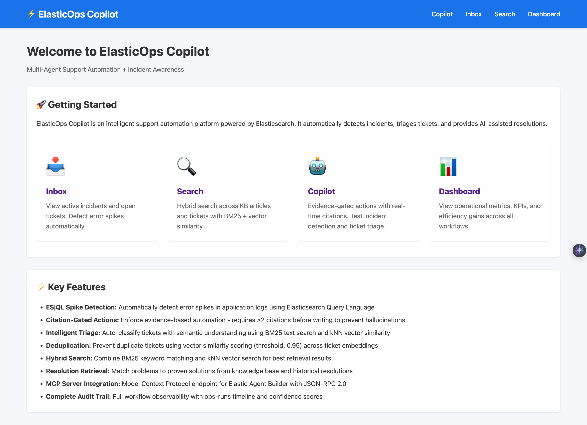
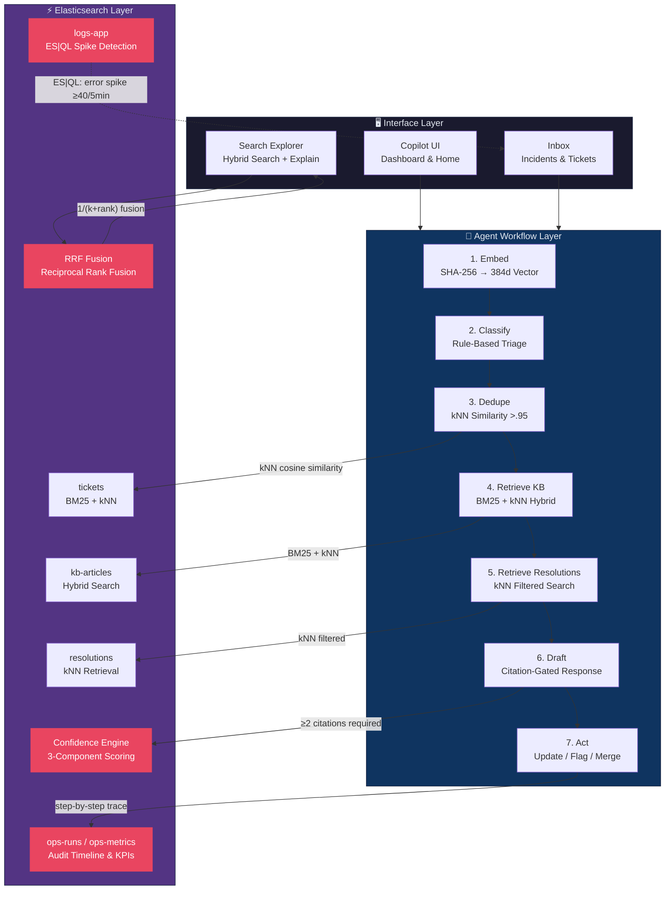
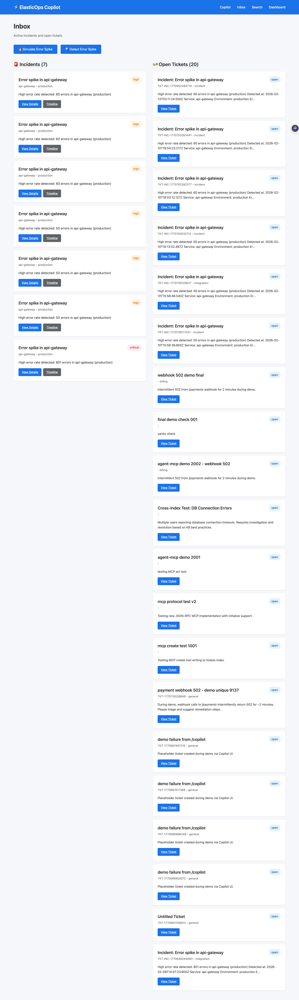
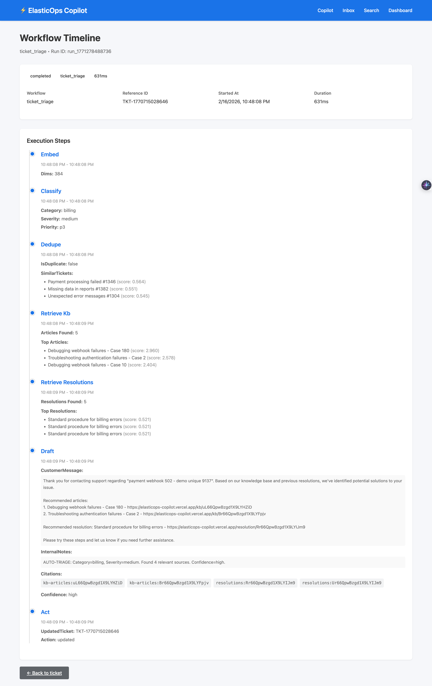
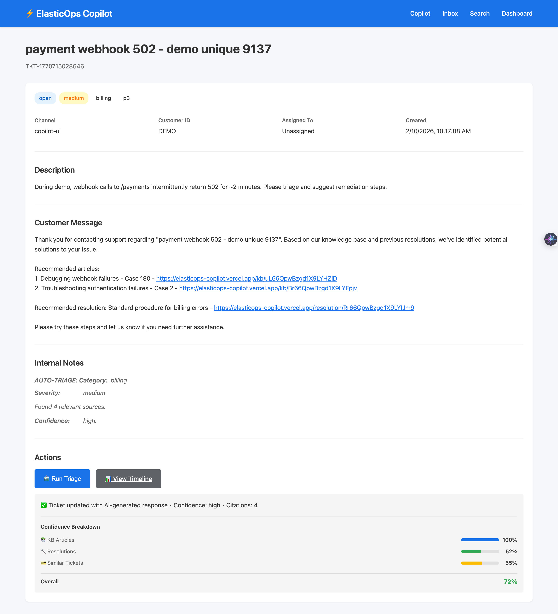
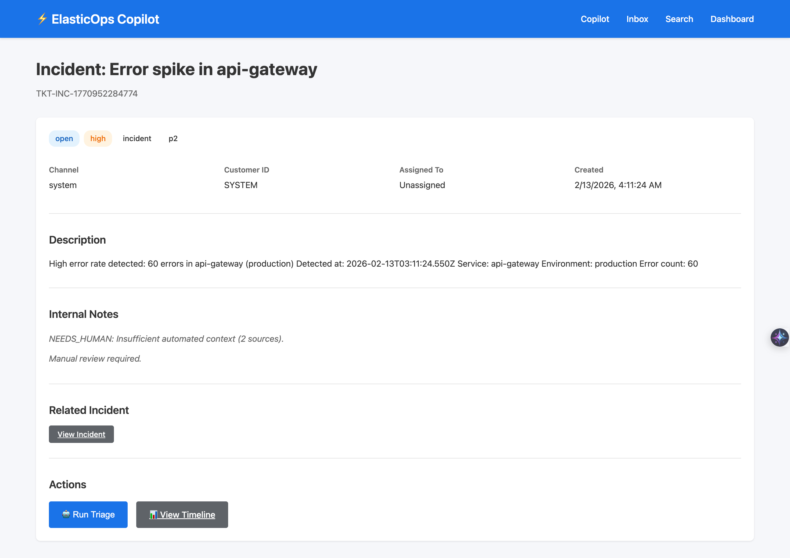
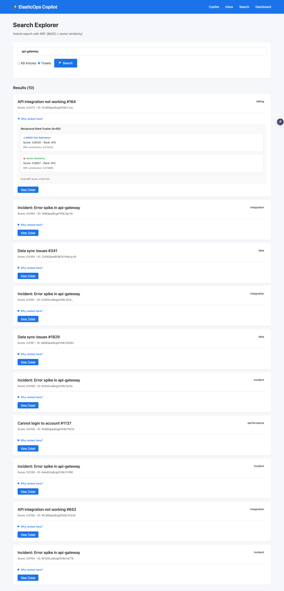
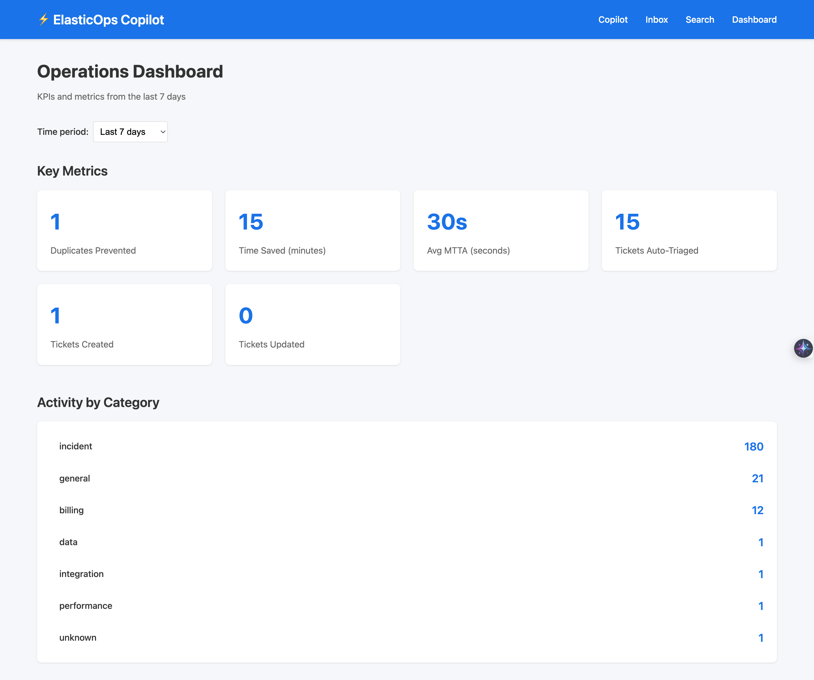
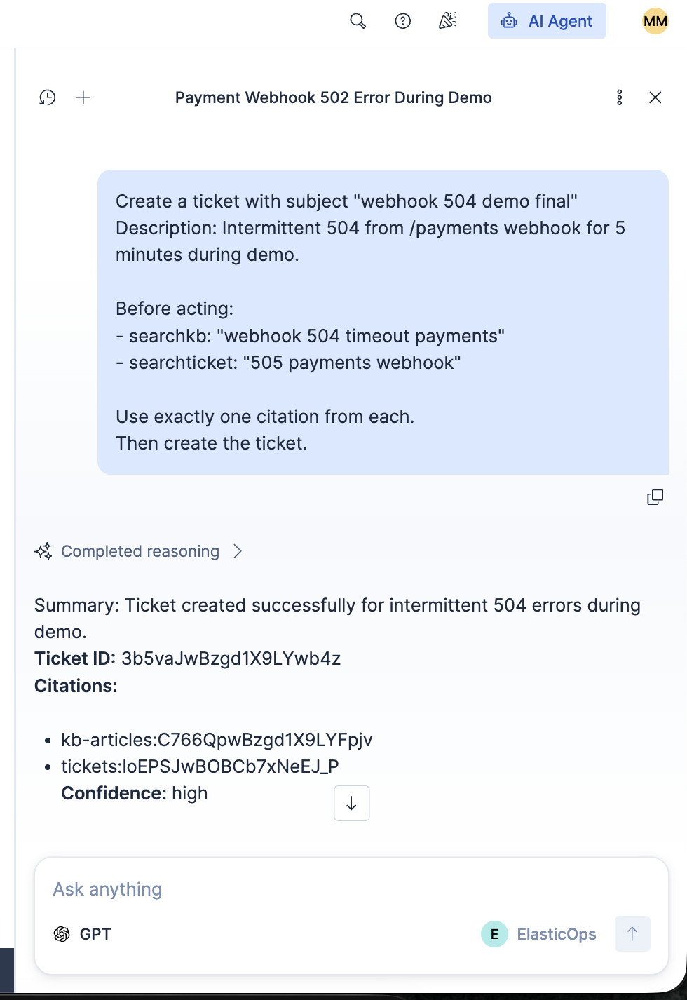

# 🚀 ElasticOps Copilot

**Evidence-Gated AI Support Automation — Powered Entirely by Elasticsearch**

> AI-driven ticket triage that **refuses to hallucinate**. Every automated response requires ≥2 grounded citations from Elasticsearch before reaching a customer. No citations? **Routed to a human.**

[](https://elasticops-copilot.vercel.app/) [](https://elastic.co) [](https://nextjs.org) [](./LICENSE)

**Elasticsearch Features Used:** ES|QL · BM25 Full-Text · kNN Vector Search · Reciprocal Rank Fusion · Vector Deduplication · Confidence Scoring · Audit Timeline

<p align="center">
  
</p>

---

## 📋 Table of Contents

1. [Problem Statement](#-problem-statement)
2. [Solution Overview](#-solution-overview)
3. [Architecture](#-architecture)
4. [Elasticsearch Features Used](#-elasticsearch-features-deep-dive)
5. [Workflow Pipeline](#-workflow-pipeline)
6. [Safety & Explainability](#-safety--explainability)
7. [Local Setup](#-local-setup)
8. [Demo Walkthrough](#-demo-walkthrough)
9. [License](#-license)

---

## ❌ Problem Statement

AI-powered support automation sounds great — until it fails catastrophically:

| Failure Mode | What Happens | Real-World Impact |
|---|---|---|
| **Hallucination** | LLM fabricates solutions that don't exist | Customers follow wrong steps, escalate |
| **No Grounding** | Responses lack evidence from actual docs | Support team can't verify AI answers |
| **No Auditability** | Decisions are black-box | Compliance fails, debugging impossible |
| **Duplicate Noise** | Same issue creates multiple tickets | Teams waste hours on redundant work |

Traditional AI support tools generate confident-sounding answers with zero accountability. **ElasticOps Copilot takes the opposite approach.**

---

## ✅ Solution Overview

ElasticOps Copilot is an **evidence-gated AI support agent** where every decision is grounded in Elasticsearch data:

- 🔍 **Real-time incident detection** using ES|QL aggregations over application logs
- 🧠 **Hybrid retrieval** combining BM25 full-text search with kNN vector similarity via Reciprocal Rank Fusion (RRF)
- 🔗 **Semantic deduplication** using vector similarity to prevent duplicate tickets
- 🛡️ **Citation gating** — auto-responses require ≥2 verified sources, otherwise routed to humans
- 📊 **Confidence scoring** with transparent three-component breakdown (KB, resolutions, similar tickets)
- 📝 **Full audit trail** — every agent step is logged to Elasticsearch with timestamps and evidence

**Every feature runs on Elasticsearch. No external AI APIs required for core functionality.**

---

## 🏗 Architecture



---

## 🔍 Elasticsearch Features Deep Dive

### 1. ES|QL — Real-Time Spike Detection

Detects error spikes in application logs using Elasticsearch's native query language:

```sql
FROM logs-app
| WHERE @timestamp >= NOW() - 5 minutes
| WHERE level == "ERROR"
| STATS errors = COUNT(*) BY service, env
| WHERE errors >= 40
| SORT errors DESC
```

📁 [`lib/esql.ts`](./lib/esql.ts) — When a spike is detected, an incident is auto-created and linked to a new ticket.

### 2. BM25 Full-Text Search

Term-frequency scoring across KB articles and tickets:

```typescript
multi_match: {
  query: queryText,
  fields: ['title^2', 'content'],
  fuzziness: 'AUTO',
}
```

📁 [`lib/searchTemplates.ts`](./lib/searchTemplates.ts) — Boosts title matches 2× for relevance.

### 3. kNN Vector Similarity

384-dimensional vectors for semantic search, deduplication, and resolution retrieval:

```typescript
knn: {
  field: 'embedding',
  query_vector: queryVector,
  k: 10,
  num_candidates: 100,
}
```

📁 [`lib/embed.ts`](./lib/embed.ts) — Deterministic SHA-256 embeddings, no external API needed.

### 4. Reciprocal Rank Fusion (RRF)

Combines BM25 and kNN results using rank-based fusion:

```typescript
// RRF formula: score = Σ 1/(k + rank)
rrfScore += 1 / (rrfK + bm25.rank);
rrfScore += 1 / (rrfK + knn.rank);
```

📁 [`app/api/search/route.ts`](./app/api/search/route.ts) — Each result shows component BM25 score, kNN score, and final RRF rank.

### 5. Vector-Based Deduplication

Prevents duplicate tickets using kNN cosine similarity with a 0.95 threshold:

```typescript
const isDuplicate = similarTickets.some(t => t.score > 0.95);
```

📁 [`app/api/run/ticket/[id]/route.ts`](./app/api/run/ticket/%5Bid%5D/route.ts) — Duplicates are tagged and surfaced for merging.

### 6. Confidence Scoring Model

Three-component weighted scoring:

| Component | Weight | Source |
|---|---|---|
| KB Article Relevance | 40% | Top-3 avg kNN+BM25 scores |
| Resolution Match | 30% | Top-3 avg kNN scores |
| Similar Ticket Signal | 30% | Top-3 avg kNN scores |

Decision paths: **≥0.7 → Auto-triage** | **0.4–0.7 → Needs Review** | **<0.4 → Human Only**

### 7. Audit Timeline Tracking

Every workflow execution writes a complete trace to `ops-runs`:

```json
{
  "run_id": "run_1708...",
  "workflow": "ticket_triage",
  "steps": {
    "embed": { "started_at": "...", "dims": 384 },
    "classify": { "category": "authentication", "severity": "high" },
    "dedupe": { "isDuplicate": false, "similarTickets": [...] },
    "retrieve_kb": { "articles_found": 5 },
    "draft": { "confidence": "high", "citations": [...] },
    "act": { "action": "updated" }
  },
  "duration_ms": 342
}
```

KPIs tracked in `ops-metrics`: duplicates prevented, time saved, tickets auto-triaged, MTTA.

---

## 🔄 Workflow Pipeline

The triage agent executes a deterministic 7-step pipeline for every ticket:

```
Embed → Classify → Dedupe → Retrieve KB → Retrieve Resolutions → Draft → Act
```

| Step | What It Does | Elasticsearch Feature |
|---|---|---|
| **1. Embed** | Generate 384-dim vector from ticket text | SHA-256 deterministic embedding |
| **2. Classify** | Assign category, severity, priority | Rule-based on ticket content |
| **3. Dedupe** | Find similar open tickets (score >0.95 = duplicate) | kNN vector search with filters |
| **4. Retrieve KB** | Find relevant knowledge base articles | BM25 + kNN hybrid search |
| **5. Retrieve Resolutions** | Find matching resolution playbooks | kNN filtered by category + severity |
| **6. Draft** | Generate response with citations | Citation gating (≥2 sources) |
| **7. Act** | Update ticket, write audit log, record metrics | ES index + ops-runs timeline |

Each step records timestamps, inputs, and outputs to the audit trail — making the entire process **reproducible and debuggable**.

---

## 🛡️ Safety & Explainability

ElasticOps Copilot is built for **trust, not just speed**. Three safety mechanisms prevent AI failures:

### Citation Gate — ≥2 Sources Required

```typescript
const shouldUpdate = confidence === 'high'
  && citations.length >= 2
  && !isDuplicate;
```

If the agent can't find at least 2 relevant sources (KB articles + resolutions), it **refuses to auto-respond** and flags the ticket for human review.

### Confidence Breakdown — Transparent Scoring

Every triage result includes a breakdown showing exactly why the system is confident (or not):

```
{
  "kb_score": 0.82,          // How well KB articles matched
  "resolution_score": 0.71,  // How well resolutions matched
  "similar_tickets_score": 0.45,  // Historical ticket similarity
  "overall": 0.68            // Weighted: 40% KB + 30% Res + 30% Tickets
}
```

### NEEDS_HUMAN Fallback — When AI Can't Be Sure

Three decision paths keep humans in the loop:

| Confidence | Citations | Action |
|---|---|---|
| **High** (≥0.7) | ≥2 | ✅ Auto-triage + update ticket |
| **Any** | Any | 🔗 Duplicate → tag for merge |
| **Low** (<0.7) | <2 | 🚨 `NEEDS_HUMAN` — routed to agent |

Internal note on flagged tickets: `"NEEDS_HUMAN: Insufficient automated context. Manual review required."`

---

## 🛠️ Local Setup

### Prerequisites

- Node.js ≥18
- Docker (for local Elasticsearch) OR an Elastic Cloud account

### Quick Start

```bash
# Clone and install
git clone https://github.com/your-org/elasticops-copilot.git
cd elasticops-copilot
npm install

# Start the app
npm run dev
```

Opens at: **http://localhost:3000**

### Environment Configuration

Copy `.env.example` and configure:

```bash
cp .env.example .env.local
```

```env
# Elasticsearch — choose cloud or local
ELASTIC_MODE=cloud                    # 'cloud' or 'local'
ELASTIC_CLOUD_ID=your_cloud_id_here   # For cloud mode
ELASTIC_API_KEY=your_api_key_here     # For cloud mode
ELASTIC_URL=http://localhost:9200     # For local mode

# Application
EMBED_DIMS=384
APP_URL=http://localhost:3000
```

### Docker (Local Elasticsearch)

```bash
# One-command bootstrap: starts ES, creates indices, generates data, runs app
./demo/bootstrap.sh
```

See [`CLOUD_SETUP.md`](./CLOUD_SETUP.md) for Elastic Cloud configuration.

---

## 🎬 Demo Walkthrough

### 1. Incident Detection *(45s)*
- Navigate to `/inbox` → Click **"Detect Error Spike"**
- ES|QL finds error spikes → auto-creates incident + ticket
- View timeline showing each detection step

| Inbox — Incident List | Audit Timeline |
|---|---|
|  |  |

### 2. Ticket Triage *(60s)*
- Open any ticket → Click **"Run Triage"**
- Watch: Embed → Classify → Dedupe → Retrieve → Draft → Act
- Review citations, confidence score, and KB recommendations

| Ticket Detail | Triage Results |
|---|---|
|  |  |

### 3. Search Explorer *(30s)*
- Navigate to `/search` → Search: "authentication error"
- Toggle KB vs Tickets mode
- Expand **"Why ranked here?"** to see BM25/kNN/RRF scoring

| BM25 Search | kNN Vector Search |
|---|---|
|  |  |

### 4. Dashboard & Copilot *(15s)*
- View KPIs: duplicates prevented, time saved, MTTA
- Chat with the AI Copilot for guided support

| Dashboard | Copilot Chat |
|---|---|
|  |  |

---

## 📁 Project Structure

```
elasticops-copilot/
├── app/                           # Next.js 14 App Router
│   ├── api/
│   │   ├── run/ticket/[id]/      # 7-step triage workflow
│   │   ├── run/incident/detect/  # ES|QL spike detection
│   │   ├── search/               # RRF hybrid search
│   │   ├── metrics/              # KPI aggregations
│   │   └── timeline/[id]/        # Audit trail viewer
│   ├── inbox/                    # Incidents + tickets list
│   ├── search/                   # Search explorer UI
│   └── dashboard/                # Metrics dashboard
├── lib/
│   ├── esql.ts                   # ES|QL spike detection queries
│   ├── searchTemplates.ts        # BM25, kNN, hybrid search builders
│   ├── embed.ts                  # Deterministic 384-dim embeddings
│   └── elastic.ts                # Elasticsearch client
├── infra/
│   ├── mappings/                 # 7 index mappings (JSON)
│   └── docker-compose.yml        # Local Elasticsearch
├── agent_builder/                 # Agent Builder integration artifacts
└── demo/                          # Bootstrap scripts + demo materials
```

---

## 📄 License

MIT License — see [LICENSE](./LICENSE)

---

## 🙏 Acknowledgments

Built for the Elasticsearch Hackathon. Every core feature — search, analytics, storage, scoring, and observability — runs on Elasticsearch. No external AI APIs required for the triage pipeline.

---

**Quick Links:**
[📋 Inbox](https://elasticops-copilot.vercel.app/inbox) · [🔍 Search](https://elasticops-copilot.vercel.app/search) · [📊 Dashboard](https://elasticops-copilot.vercel.app/dashboard) · [🤖 Copilot](https://elasticops-copilot.vercel.app/copilot)
